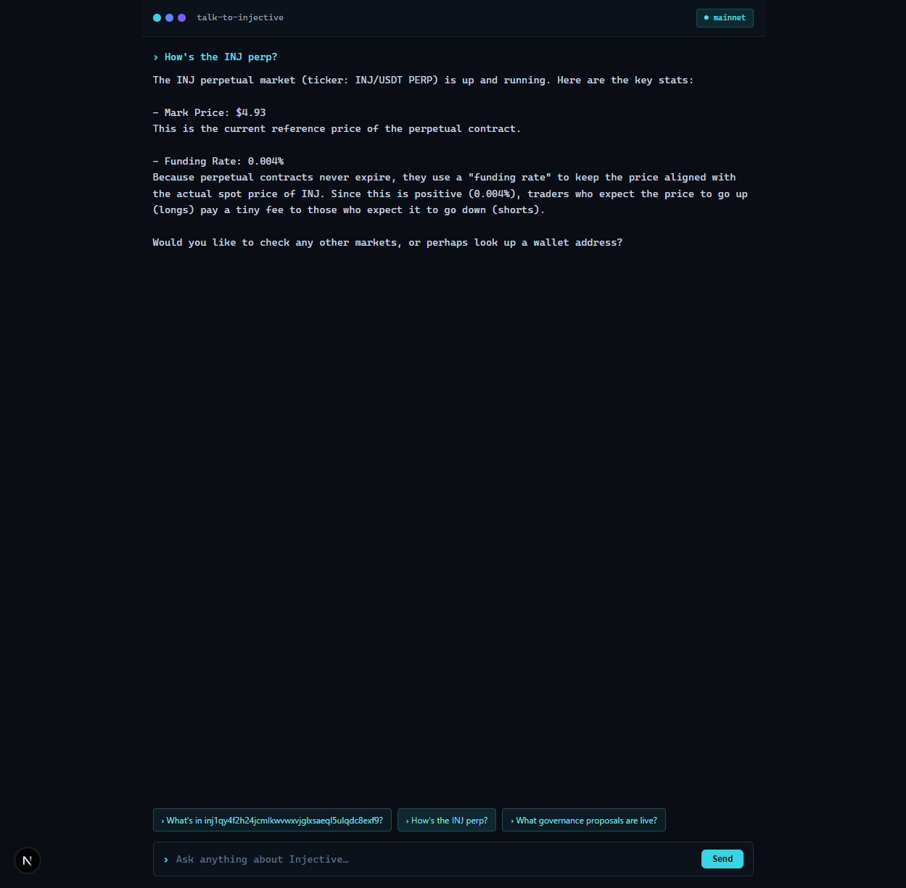

# Talk to Injective

A friendly AI chat that explains Injective in plain English using **live mainnet
on-chain data** — wallets, markets, governance, and staking. Read-only: no trading,
no signing, no private keys.

## Why
Injective is a trading chain, so most tools assume you already speak the language
(funding rates, perps, subaccounts, governance params, staking APR). This is the
opposite: you just chat, and it reads the chain and explains what's going on for
newcomers.

## How AI is used
A chat agent (Gemini 3 Flash via OpenRouter, wired with the Vercel AI SDK) turns
plain questions into the right on-chain read, then explains the result for someone
new to crypto. The model never invents numbers — every figure comes from a tool call,
and the tools return structured data the model summarizes. It defines terms inline as
it goes, and when you ask where to actually stake, trade, or vote it points you to the
official Injective apps (the Hub and Helix) — it never acts for you.

Four tools:
- `getPortfolio(address)` — token balances + open derivative positions
- `getMarketSnapshot(market)` — mark price, funding rate, open interest
- `getGovernance(proposalId?)` — active proposals, or one explained in plain English
- `getStaking(address?)` — estimated staking APR and total INJ bonded, plus a wallet's
  delegations and pending rewards

Each tool is a small, self-contained module in `lib/injective/` — reusable on its own
as a typed, read-only Injective data helper.

## How Injective is integrated
All data is read through the official `@injectivelabs/sdk-ts` against mainnet:
- **Bank module** (`ChainGrpcBankApi`) — wallet balances
- **Exchange / derivatives indexer** (`IndexerGrpcDerivativesApi`) — markets, funding, positions
- **Governance module** (`ChainGrpcGovApi`) — proposals
- **Staking + Mint + Distribution modules** (`ChainGrpcStakingApi`, `ChainGrpcMintApi`,
  `ChainGrpcDistributionApi`) — bonded pool, annual provisions and community tax (for the
  APR estimate), wallet delegations, and pending rewards

Raw chain values (base units, denoms, chain-scaled prices) are normalized to
human-readable units before they reach the model, which keeps answers accurate.

Optionally connect a Keplr or Leap wallet (read-only, address only) to point the
quick-action prompts at your own wallet — the app never requests a signature.

## Run it
1. `npm install`
2. `cp .env.local.example .env.local` and add an `OPENROUTER_API_KEY` (https://openrouter.ai/keys)
3. `npm run dev` → http://localhost:3000

## Tests
`npm test` — unit tests for the normalization/resolver logic, plus integration tests
that read Injective mainnet (network required; no key needed for those).

## Stack
Next.js (App Router), Vercel AI SDK, OpenRouter (Gemini 3 Flash), `@injectivelabs/sdk-ts`.
